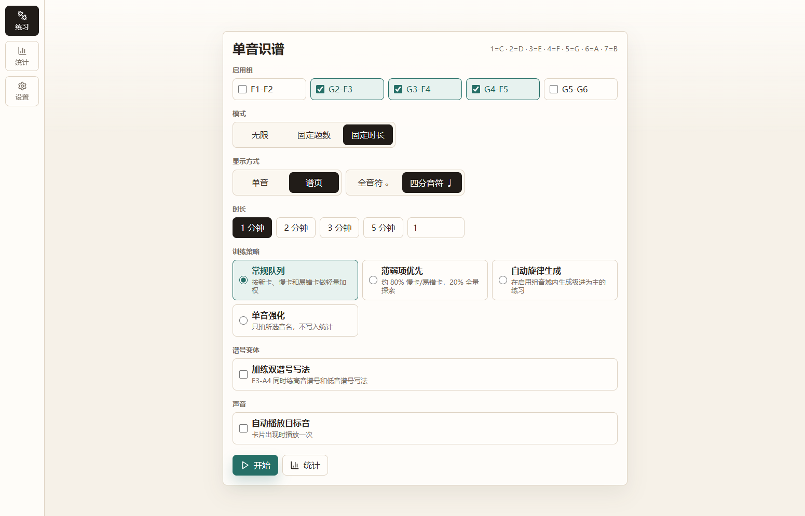
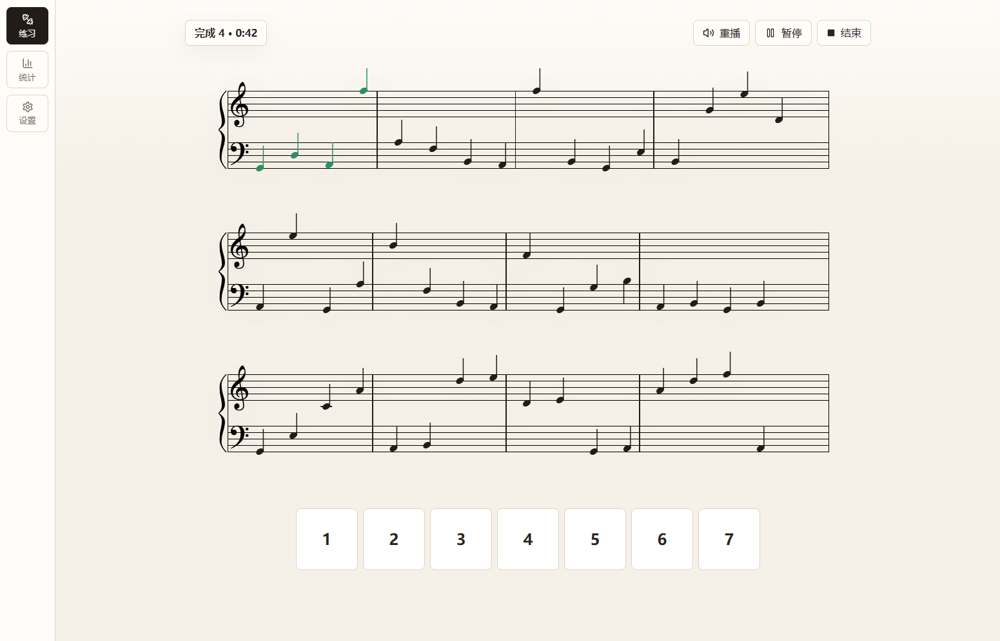
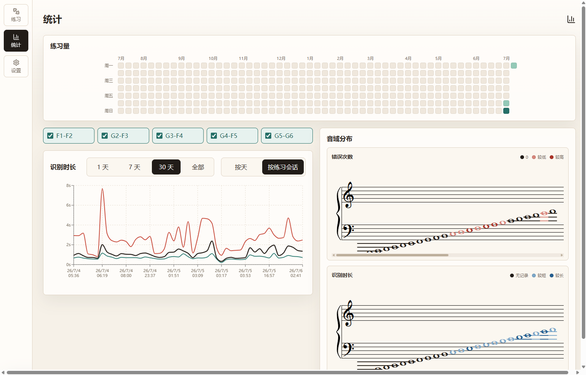

# piano-learning

钢琴五线谱单音识谱练习工具。练习记录保存在浏览器本地，可按音区、谱表间加线写法和训练策略安排练习；学习页还支持按音名默写全部谱位并比较历次完成时间。

本项目基于 [coolermzb3/anki-note](https://github.com/coolermzb3/anki-note) 二次开发。

在线演示：[https://gohusky.cn/piano-learning/](https://gohusky.cn/piano-learning/)

源仓库目前没有提供 `LICENSE` 文件。此处注明来源不代表额外授予使用或再分发许可；公开分发前请确认相应授权。

<details name="screenshots" open>
<summary>练习设置</summary>



</details>

<details name="screenshots">
<summary>练习中</summary>



</details>

<details name="screenshots">
<summary>统计</summary>



</details>

## 本地运行

### Windows

Windows 本机可直接双击 `start.bat`。也可以在仓库目录运行：

```bash
corepack enable pnpm
pnpm install
pnpm run dev
```

### macOS

在仓库目录使用 macOS 上安装的 Node.js 和 pnpm：

```bash
corepack enable pnpm
pnpm install
pnpm run dev
```

开发服务器默认地址为 `http://127.0.0.1:6136/`。macOS 和 Windows 的 `node_modules` 不要共用。

首次配置开发环境时，安装提交钩子：

```bash
uv sync --project analysis
uv run --project analysis pre-commit install
```

提交钩子会检查并格式化 `analysis/` 下的 Python 代码，并在每次提交前执行前端生产构建。当前前端构建钩子使用 Windows PowerShell，因此可在 Windows/WSL 使用；macOS 开发时按下文命令手动执行所需的生产构建。该提交钩子尚未跨平台，提交时需要在 Windows/WSL 环境运行。
前端构建包含 TypeScript 检查，未导入的名称等编译错误会阻止提交。每个工作区都需要安装一次钩子；没有安装时，本地提交不会触发这些检查。也可以手动运行：

```bash
uv run --project analysis pre-commit run frontend-build --all-files
```

GitHub Actions 会在推送到 `main`、创建 Pull Request 或手动触发时运行测试和生产构建。它只做校验，不会部署页面。

## MIDI 键盘

首次使用时在“设置 → MIDI 键盘”中授权并选择输入设备。浏览器已有 MIDI 权限时，后续打开页面会静默尝试恢复连接；未授权或自动连接失败时仍可手动连接。连接后可在练习前选择：

- `只认音名`：电脑数字键、屏幕琴键和 MIDI 可同时作答，MIDI 不限八度；
- `精确音高`：只接受 MIDI 输入，音名与八度都必须和谱面一致。设备断开时练习会自动暂停。

连接后还可在练习设置页或结果页按 C4 开始。设备测试、按键生命周期和历史分组规则见 [MIDI 输入说明](docs/midi-input.md)。

## 常用命令

```bash
pnpm test
pnpm run build
```

## 开发文档

- [MIDI 输入与答题判定](docs/midi-input.md)
- [练习历史比较规则](docs/practice-comparison.md)
- [答对进度图规则](docs/session-progress.md)
- [自动旋律生成规则](docs/melody-generation.md)
- [麦克风单音答题与 iOS / iPadOS 识别调查](docs/specs/microphone-single-note-answer.md)
- [UI 手调位置速查](docs/ui-tuning.md)

## 发布与预览

线上演示部署由维护者按需执行，不会由构建、提交或推送自动触发。部署脚本保存在本地 `scripts/deploy/` 目录并被 Git 忽略；部署步骤见 [`scripts/deploy/README.md`](scripts/deploy/README.md)。文档可以提交，部署脚本和服务器配置不会提交。

### 部署线上演示

部署脚本只校验并发布已有的 `dist/`，不会替你构建。必须先为 `/piano-learning/` 生成新鲜的生产产物：

Windows/WSL 在仓库目录运行：

```bash
uv run --project analysis pre-commit run frontend-build --all-files
```

macOS 在仓库目录运行：

```bash
GITHUB_PAGES=true GITHUB_REPOSITORY=crazy-husky/piano-learning pnpm run build
```

部署脚本需要本机 Bash、Python 3、curl、SSH/SCP 和 `expect`。macOS 可通过 Homebrew 安装缺少的 `expect`；Windows 请使用已安装这些命令的 Git Bash。维护者需在仓库外准备私有部署配置文件；本机脚本默认读取 `~/.config/captcha-recognition/deploy.env`，也可通过 `PRIVATE_DEPLOY_ENV` 指向其他位置。配置包含远程连接凭据，不能提交到 Git 或写入命令行示例。

从 macOS 或 Git Bash 的仓库根目录先运行本地检查，再显式部署：

```bash
export PRIVATE_DEPLOY_ENV="$HOME/.config/captcha-recognition/deploy.env"
export PIANO_PUBLIC_URL="https://gohusky.cn/piano-learning/"
bash scripts/deploy/deploy_piano_learning.sh --check
bash scripts/deploy/deploy_piano_learning.sh --deploy
```

如果私有配置文件放在其他位置，修改 `PRIVATE_DEPLOY_ENV`。部署脚本会检查产物路径和新旧状态，按 SHA-256 仅传输发生变化的静态文件；发布后会核对 HTTPS 响应，验证失败时尝试恢复旧版本。它不会上传项目源码，也不会触发 Git 提交或推送。部署脚本被 `.gitignore` 排除，新的克隆需要由维护者单独准备该本地工具。

### 临时 HTTPS 预览

`tailscale-preview-on.bat` 和 `tailscale-preview-off.bat` 当前只适用于 Windows。Windows 本机已登录 Tailscale 后，可双击 `tailscale-preview-on.bat`。脚本开头询问是否启用公网访问：直接按 Enter 或输入非 `y` 值时使用 Tailscale Serve，仅 Tailnet 内可访问；输入 `y` 时使用 Tailscale Funnel，允许公网访问。公网模式要求当前 tailnet 已启用 Funnel。macOS 开发时可直接使用本地 Vite 服务；需要 HTTPS 预览时可使用线上演示地址。

脚本会构建当前工作区，在 `127.0.0.1:6137` 启动独立的 Vite 预览，并提供 HTTPS；它不会占用或停止 `6136` 开发服务器。开启成功后保留该窗口，测试完成时直接按 Enter 即可关闭 Tailscale 入口和 `6137` 预览。

Funnel 地址没有应用级密码。如果误关了开启脚本的窗口，必须双击 `tailscale-preview-off.bat` 补做清理。关闭操作会先撤销 Serve 或 Funnel 入口，再停止脚本启动的 `6137` 预览；若该端口被无关进程占用，脚本会拒绝停止或覆盖该进程。
